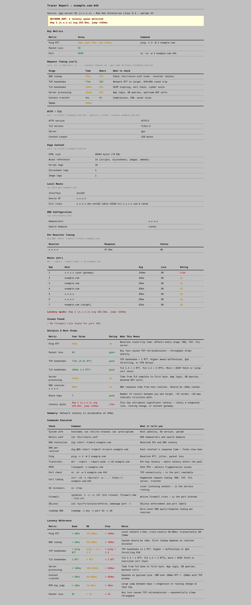

# Tracer — Comprehensive Webpage & Network Diagnostics

Single-command diagnostic tool. Pipe it over SSH to any Linux host with Python 3.6+, get a JSON report, render it as HTML.

## Quick Start

```bash
# Run diagnostics on remote host
ssh user@host 'python3 - --json -p 443 example.com' < tracer.py > facts.json

# Render HTML analytics report
python3 render_report.py facts.json report.html
```



Open `report.html` in a browser.

## Scenarios

### Website Loading Slow

```bash
ssh user@webserver 'python3 - --json -p 443 mysite.com' < tracer.py > facts.json
python3 render_report.py facts.json report.html
```

Checks: DNS, ping, MTR, curl waterfall (DNS/TCP/TLS/server/transfer timing), HTTP version, TLS version/cipher, page asset count.

### Oracle Middleware on PCA (WebLogic)

```bash
ssh user@pca-host 'python3 - --json -p 7001 weblogic-host' < tracer.py > facts.json
python3 render_report.py facts.json report.html
```

Also check the DB listener and Node Manager separately:

```bash
ssh user@pca-host 'python3 - --json -p 1521 db-host' < tracer.py > db-facts.json
ssh user@pca-host 'python3 - --json -p 5556 wls-host' < tracer.py > nm-facts.json
```

What to look for: WebLogic console latency (server processing time), DB listener response, bond interface detection in route output.

### VPN / Remote Worker Troubleshooting

```bash
# Run on the user's machine
ssh user@laptop 'python3 - --json -p 443 internal-app.corp.com' < tracer.py > facts.json
```

Look at: Local Route (interface name — `wgivpn`, `tun0`), hop 1 RTT. A slow gateway + VPN interface = VPN overhead.

### DNS Problem (FreeIPA, AD DNS)

```bash
ssh user@host 'python3 - --json -p 443 slow-app.internal' < tracer.py > facts.json
```

Look at: Per-Resolver Timing table — identifies which resolver is slow. Search domain count — too many domains cause retry storms.

### Firewall / SELinux Audit

```bash
# Requires sudo on target
ssh user@host 'sudo python3 /path/to/tracer.py --json -p 443 app-server' < tracer.py > facts.json
```

Look at: Issues Found section — flags missing firewall rules, SELinux port labels, blocked ports.

### Fast Mode (skip MTR, PMTU, tcpdump, curl)

```bash
ssh user@host 'python3 - --json --quick -p 443 example.com' < tracer.py > facts.json
```

Cuts runtime from ~90s to ~15s. Good for initial triage or slow connections.

## Report Sections

| Section | What it shows | For |
|---------|--------------|-----|
| Verdict | NETWORK / SERVER / DNS / TLS / OK | Instant diagnosis |
| Key Metrics | Ping RTT, packet loss, port status | Quick health check |
| Request Timing | DNS → TCP → TLS → Server → Transfer breakdown | Where latency goes |
| HTTP / TLS | Protocol version, cipher, key exchange | Modern protocol check |
| Page Content | HTML size, asset count (scripts, CSS, images) | Page weight |
| Local Route | Gateway, interface, source IP | VPN/network check |
| DNS | Nameservers, search domains, per-resolver timing | DNS health |
| Route (mtr) | Per-hop latency with good/ok/slow ratings | Where latency enters |
| Issues Found | Firewall gaps, SELinux blocks, tcpdump failures | Security gaps |
| Latency Reference | Good / OK / Slow thresholds for every metric | No prior knowledge needed |
| Commands Executed | Every command that produced each section | Reproduce manually |

## Output Formats

```bash
# JSON (for automation)
ssh user@host 'python3 - --json -p 443 example.com' < tracer.py

# Markdown (for docs)
ssh user@host 'python3 - --md --stdout -p 443 example.com' < tracer.py

# Markdown to file
ssh user@host 'python3 - --md -p 443 example.com' < tracer.py
# writes tracer-report-example.com-20260612-120000.md to CWD
```

## Requirements

**Target host:** Python 3.6+, standard Linux tools (`ping`, `dig`, `curl`, `mtr`, `ss`, `nc`, `tcpdump` optional).

**Render host:** Python 3.6+, no dependencies. Chart.js embedded inline (no network needed to view).

## Files

```
tracer/
├── tracer.py           # Diagnostics engine — pipe or copy to target
├── render_report.py    # JSON → HTML report — runs locally
├── report.html         # Generated report
└── README.md
```

## Tips

- Run with `sudo` for tcpdump DNS capture and full firewall/SELinux data
- Use `--quick` for fast triage (skips MTR, PMTU, tcpdump, curl waterfall)
- If the target is a hostname, it resolves on the remote host — tests actual DNS path
- If the target is an IP, DNS checks are skipped
- The HTML report is fully self-contained — share it as a single file
